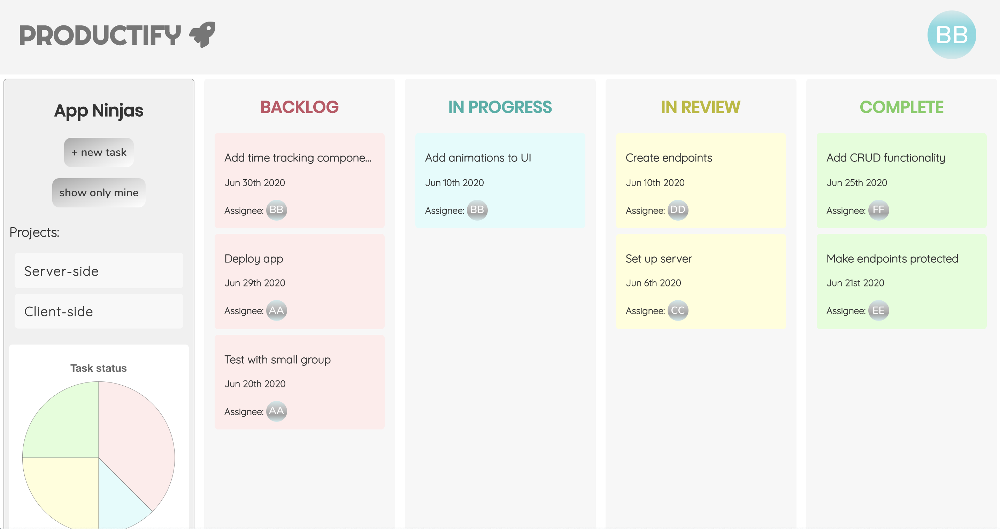
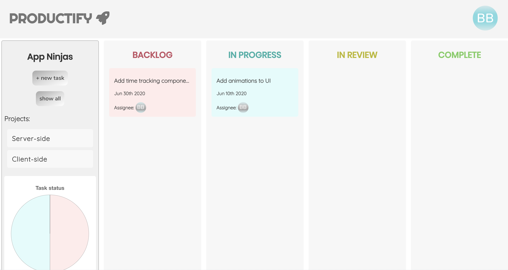
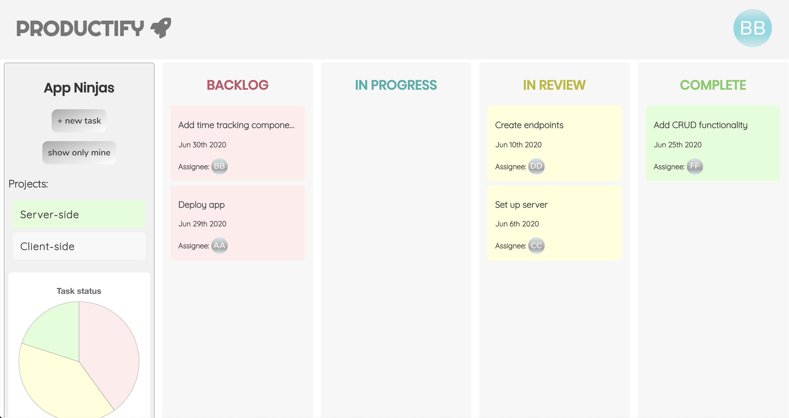
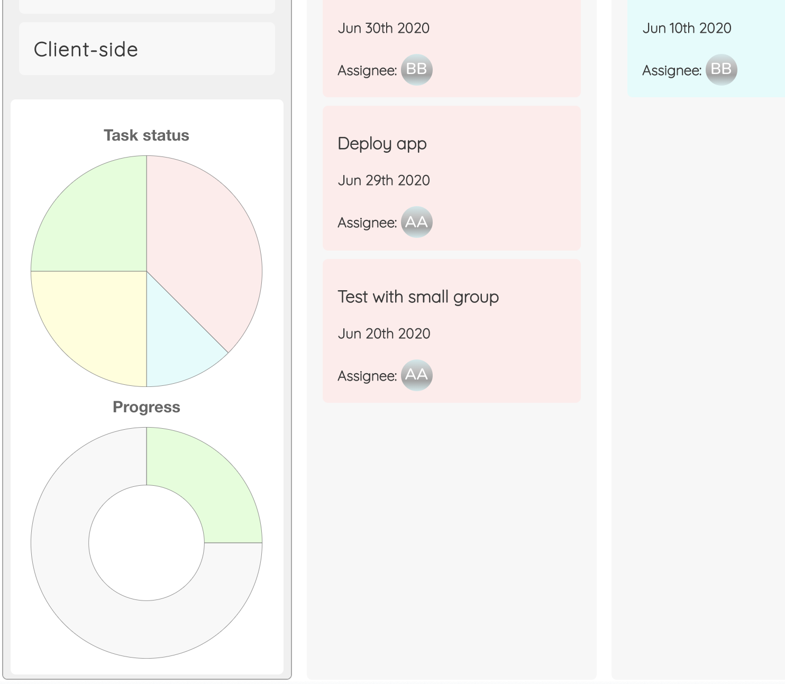
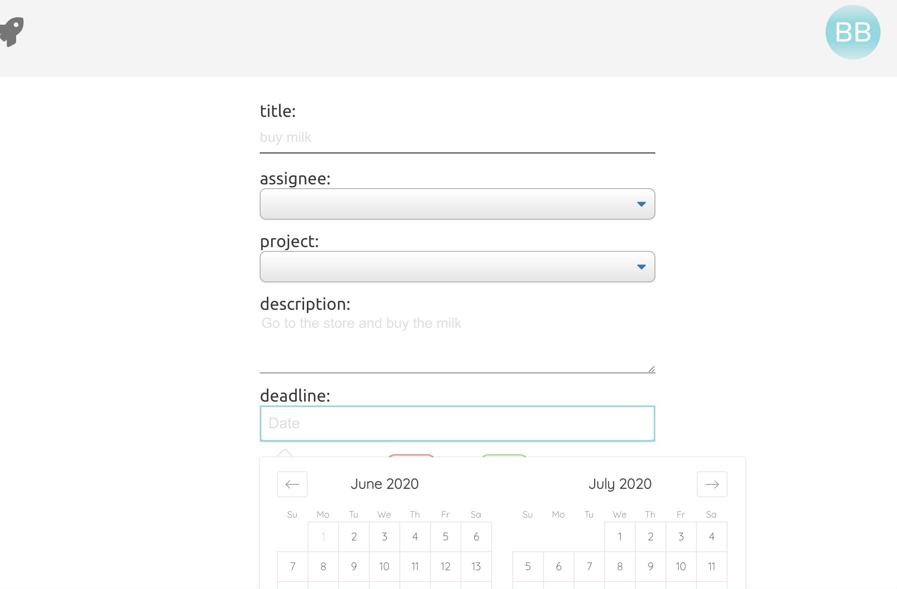
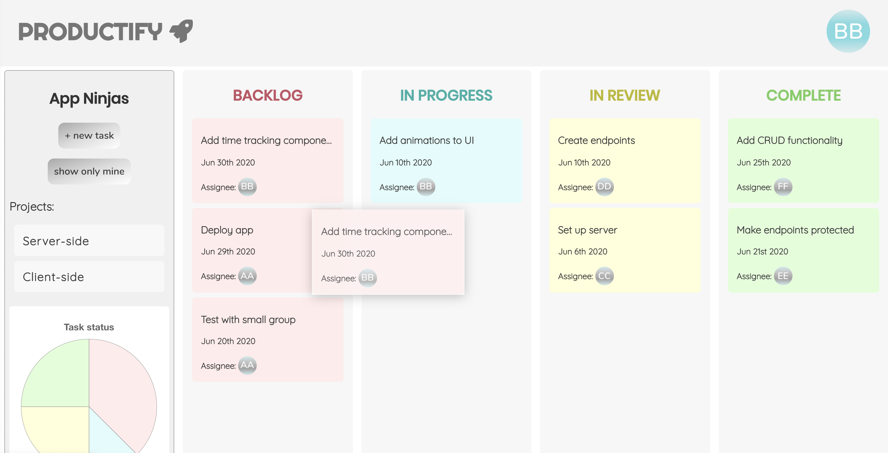
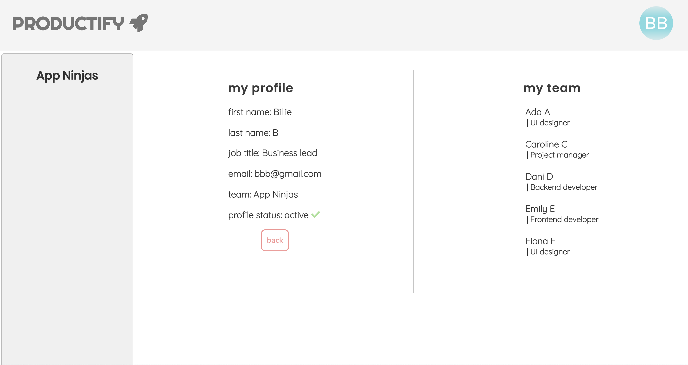

# Productify

Productify is your new favorite tool for organizing projects and increasing productivity. Designed for any form of team work, from software development to HR, sales to product management, Productify allows you to efficiently lay out what tasks need to be done, what the task's progress is, and who should be assigned to take on the task. The interface also provides responsive charts to give a quick visual overview of a project's progress.

## Demo

A demo version is available [here](https://productify-app.now.sh/).
Use the following dummy credentials to log in and take a tour:

Username: aaa@gmail.

Password: aaa

Please note that this demo version is intended for demo purposes only. For security purposes, we do not recommend that you sign up using your own personal information.

## Installation

Simply clone the repo and run ```npm i```
You will also need to connect this client to a server. A modifiable version can be found [here](https://github.com/ailsamm/productify-server) (simply clone, run ```npm i``` and then, in this app, change the URL in the ./src/config.js) or work with the already-deployed version that is specified already in ./src/config.js.

## Tech Stack
Productify is written with ReactJS, Javascript, HTML5, CSS3.

## Usage
See the following screenshots for an overview of how Productify can be used.













